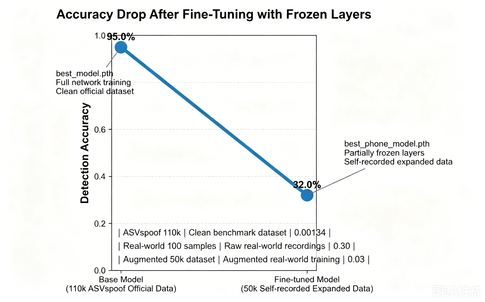

# 🛡 GemmaShield
## AI Voice Scam Detection System for Elderly Protection

> An AI-powered multimodal scam detection system combining CNN-based voice spoof detection, Whisper speech recognition, and Gemma4 reasoning to help protect elderly users from AI-generated voice scams.
# 🖼 Demo Preview


---


# 🌟 Project Background

With the rapid advancement of AI voice cloning technology, AI-generated scam calls are becoming increasingly realistic and dangerous, especially for elderly users.

Current voice spoof detection research often achieves excellent performance on benchmark datasets, but many systems struggle in real-world noisy environments.

GemmaShield was created to explore:

- real-world AI voice scam detection
- robustness challenges
- explainable AI safety systems
- elderly-oriented AI interaction

Rather than only optimizing benchmark scores, this project intentionally investigates the gap between laboratory performance and real-world deployment challenges.

The long-term goal of GemmaShield is to build robust and explainable AI safety systems that can genuinely protect vulnerable populations in real environments.

---

# 🎯 Project Goals

GemmaShield aims to:

- detect AI-generated fake voices
- analyze scam risk using LLM reasoning
- provide understandable explanations for elderly users
- study robustness limitations in real-world deployment
- explore multimodal AI security systems

---

# 🧠 System Architecture
# 🏗 System Architecture
The system uses a multimodal AI pipeline:

The system uses a multimodal AI pipeline:


# ⚙️ Core Technologies

| Component | Technology |
|---|---|
| Voice Spoof Detection | CNN |
| Speech Recognition | Faster-Whisper |
| AI Reasoning | Google Gemma4 |
| Frontend | Gradio |
| Deployment | HuggingFace Spaces |
| Audio Features | Log-Mel Spectrogram |

---

# 🔬 CNN Voice Spoof Detection

The spoof detection backbone is a CNN model trained on spectrogram features.

## Training Dataset

Initial training used:

- ASVspoof dataset
- approximately 110,000 clean training samples

## Benchmark Performance

The model achieved:

```text
EER ≈ 0.00134 on clean ASVspoof benchmark data
```markdown
---

# 📊 EER Comparison

| Dataset | Description | EER |
|---|---|---|
| ASVspoof 110k | Clean benchmark dataset | 0.00134 |
| Real-world 100 samples | Raw real-world recordings | 0.30 |
| Augmented 50k dataset | Augmented real-world training | 0.03 |

```
# 📈 Experimental Visualization


This demonstrated extremely strong performance under laboratory conditions.

---

# ⚠️ Real-World Dataset Problem

Although the model performed well on benchmark datasets, it struggled significantly with real-world audio.

To investigate this issue, we manually collected:

```text
~100 real-world audio samples
```

including:

- noisy recordings
- phone-call audio
- compressed speech
- replay attacks
- microphone variations
- AI-generated fake voices

However, because the dataset size was extremely small, direct training produced poor results:

```text
EER ≈ 0.30
```

This revealed a severe domain gap between laboratory benchmark data and real-world audio conditions.

---

# 🔬 Data Augmentation Research

To address the limited dataset size, we developed a custom augmentation pipeline.

The original 100 samples were expanded into approximately:

```text
~50,000 augmented audio samples
```

using:

- noise injection
- pitch shifting
- waveform perturbation
- frequency modification
- replay simulation
- audio distortion

Additionally:

- CSV metadata was automatically expanded
- labels were synchronized with generated samples

---

# 🧠 Transfer Learning Strategy

Instead of training from scratch, we reused the CNN pretrained on the 110k ASVspoof dataset.

We then:

- froze part of the CNN layers
- fine-tuned remaining layers
- retrained on the augmented 50k real-world dataset

This significantly improved validation performance.

## Fine-tuned Result

```text
EER ≈ 0.03
```
```pipeline
100 Real Audio
    ↓
Noise Injection
Pitch Shift
Replay Simulation
    ↓
50k Augmented Data
    ↓
Transfer Learning
    ↓
CNN Fine-tuning
```
---


# 🔍 Key Robustness Finding

One of the most important discoveries during this project was:

> Extremely low benchmark EER does not guarantee real-world robustness.

Although the fine-tuned model achieved much lower EER during validation, further testing revealed a critical issue:

- the model became very effective at recognizing genuine speech
- but struggled to detect unseen real-world fake voices

This suggested that the model had started overfitting to specific real-world characteristics.

In other words:

> the model learned to recognize “realness” rather than truly learning generalized spoof patterns.

This became one of the most important research findings of the project.

---

# 🔄 Current Deployment Strategy

After identifying the robustness issue, we decided to:

- remove problematic real-world fine-tuning
- return to the cleaner ASVspoof-trained model
- continue future robustness research separately

The currently deployed model therefore focuses on:

- stability
- generalization
- benchmark reliability

while future work will continue exploring real-world robustness optimization.

---

# 🧠 Gemma4 Integration

GemmaShield deeply integrates:

# Google Gemma4

Traditional spoof detection systems only output probabilities.

Gemma4 transforms the system into an explainable AI assistant capable of generating human-readable scam reasoning for elderly users.

Gemma4 analyzes:

- transcript content
- spoof probability
- contextual scam indicators

and generates explanations such as:

```text
Scam: Possible
Risk: Medium
Advice: Verify the caller identity before sending money.
```

This transforms the project from:

```text
"AI classifier"
```

into:

```text
"AI safety assistant"
```

---

# 👵 Elderly-Friendly Design

Because the system specifically targets elderly users, accessibility became an important design goal.

The interface includes:

- large fonts
- simplified buttons
- bilingual support (Chinese / English)
- minimal interaction complexity
- readable AI explanations

The goal is not only accurate detection, but also:

> helping elderly users understand WHY a voice may be dangerous.

---

# 🎤 Speech Recognition

The project uses:

# Faster-Whisper

for lightweight speech transcription.

Whisper converts uploaded audio into text before sending the transcript to Gemma4 for reasoning and scam analysis.

---

# 🚀 Features

- ✅ Voice spoof detection
- ✅ AI scam reasoning
- ✅ Whisper transcription
- ✅ Gemma4 explanation system
- ✅ Elderly-friendly UI
- ✅ Chinese / English support
- ✅ HuggingFace deployment
- ✅ Real-time audio upload
- ✅ CPU-compatible deployment

---

# 🌐 Online Demo

## HuggingFace Spaces

👉 Demo Link:

https://huggingface.co/spaces/Laura-smith/voice-spoof-detector

The online demo supports:

- voice upload
- real-time detection
- transcript generation
- Gemma4 analysis
- bilingual interaction

To ensure deployment stability within HuggingFace CPU memory limits:

- Gemma4 uses lazy loading
- lightweight Whisper mode is enabled
- CPU-safe inference optimization is used

---

# 📊 Example Output

```text
✅ SAFE

Real Voice Score: 0.97
Fake Voice Score: 0.03

Transcript:
"Hello, this is your grandson..."

AI Analysis:
Scam: Possible
Risk: Medium
Advice: Verify the caller identity before sending money.
```

---

# 📦 Competition Submission

This project submission includes:

## ✅ Source Code Repository

Including:

- app.py
- model.py
- train.py
- inference.py
- augmentation scripts
- deployment configuration
- README documentation

---

## ✅ 5-Minute Demonstration Video

The demo video includes:

- project motivation
- architecture explanation
- live demo
- Gemma4 reasoning showcase
- robustness discussion
- future research directions

---

## ✅ Technical Report

Including:

- dataset construction
- augmentation pipeline
- transfer learning experiments
- EER comparison
- robustness findings
- deployment optimization
- Gemma4 integration design

---


# 🏆 Evaluation Criteria Alignment

The project was designed according to the official judging dimensions.

---

# 🌍 Real-world Impact 

GemmaShield addresses a highly realistic social problem:

> AI-generated scam calls targeting elderly users.

The project emphasizes:

- social value
- elderly accessibility
- explainable AI
- future scalability
- real-world deployment discussion

---

# ⚙️ Technical Excellence 
The system integrates:

- CNN spoof detection
- Whisper ASR
- Gemma4 reasoning
- transfer learning
- augmentation pipeline
- HuggingFace optimization

Technical highlights include:

- EER optimization
- robustness analysis
- layer freezing strategy
- lazy-loaded LLM deployment
- CPU memory optimization

---

# ✅ Functional Completeness 

The demo includes:

- audio upload
- spoof detection
- transcript generation
- AI reasoning
- bilingual UI
- runtime feedback
- HuggingFace deployment

Edge-case handling includes:

- no speech detection
- delayed Gemma loading
- CPU-only deployment
- memory optimization

---

# 💡 Innovation

Key innovations include:

- combining spoof detection with LLM reasoning
- elderly-oriented explainable AI
- robustness-focused experimentation
- multimodal AI security architecture
- real-world domain gap analysis

The project intentionally studies failure cases and robustness limitations rather than only reporting benchmark success.

---

# 🖥 Local Deployment

## Install Dependencies

```bash
pip install -r requirements.txt
```

## Run Application

```bash
python app.py
```

Then open:

```text
http://127.0.0.1:7860
```

---

# 📁 Project Structure

```text
GemmaShield/
│
├── app.py
├── model.py
├── train.py
├── inference.py
├── best_model.pth
├── requirements.txt
│
├── data/
├── augmented_data/
├── csv/
├── assets/
└── README.md
```

---

# 📚 Research Significance

This project explores several important AI research directions:

- AI Security
- Voice Spoof Detection
- AI Safety
- Robustness Research
- Human-centered AI
- Explainable AI
- Multimodal AI Systems

The project demonstrates that:

> achieving low benchmark EER alone is insufficient for real-world deployment.

Robustness and real-world generalization remain critical open challenges.

---

# 🔮 Future Work

Future improvements may include:

- stronger robustness training
- adversarial spoof detection
- replay attack defense
- multilingual scam analysis
- streaming phone-call analysis
- edge-device optimization
- real-time call protection

---

# ❤️ Social Impact

GemmaShield was designed with a social-good motivation:

> using AI to help protect elderly users from increasingly sophisticated AI voice scams.

As AI-generated voices continue improving, systems like GemmaShield may become increasingly important for future digital safety infrastructure.

---

# 👤 Author

Developed by a first-year Computer Science student exploring:

- AI Security
- AI Safety
- Voice Trustworthiness
- Human-centered AI
- Multimodal AI Systems

---

# 📄 License

This project is intended for research and educational purposes.
````
